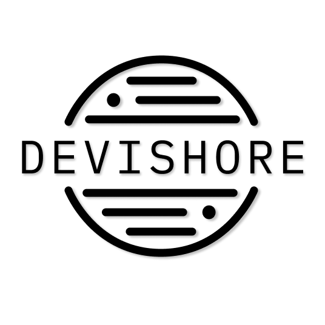
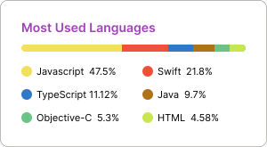

 
 

👨‍💻 I'm the Founder of [**Devishore**](https://www.devishore.com)(IT Services Agency) 
🏠 I'm currently living at BeiJing, China 🇨🇳. 
👨‍💼 I’m currently working on React Native、iOS、Android、Next.js、Strapi (full stack developer). 
🔭 I'm currently working as a freelancer(mobile development) at [**Upwork**](https://www.upwork.com/freelancers/~0102c9c121afa5239d?mp_source=share) & [**Fiverr**](https://www.fiverr.com/allenroki). 
⚡ Available for freelance projects. 
🚲 I'm a cyclist, cannondale supersix evo

## Connect with me:

 

## Languages and Tools:
<code></code>
<code></code>
<code></code>
<code></code>
<code></code> 
<code></code>
<code></code> 
<code></code> 
<code></code> 
<code></code> 
<code></code> 
<code></code> 
<code></code> 
<code></code> 

 
<code></code> 
<code></code>
<code></code> 
<code></code> 
<code></code> 

 

